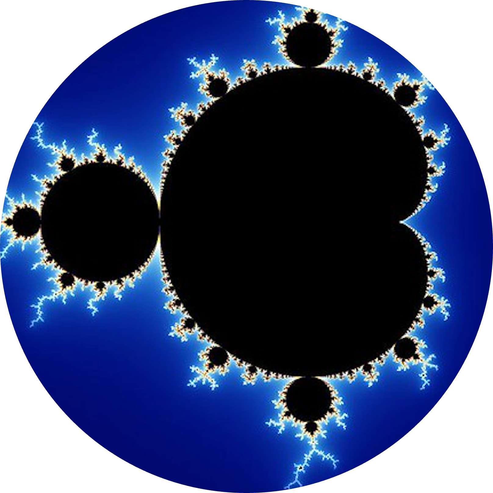

# C-utils
   

  

This project offers a set of utility libraries that aim to minimize the necessity of writing repetitive code for every project. These libraries address the common requirements I have encountered in numerous mathematical projects. The purpose of this repository is to gather and consolidate the most commonly used C functions in one place.

